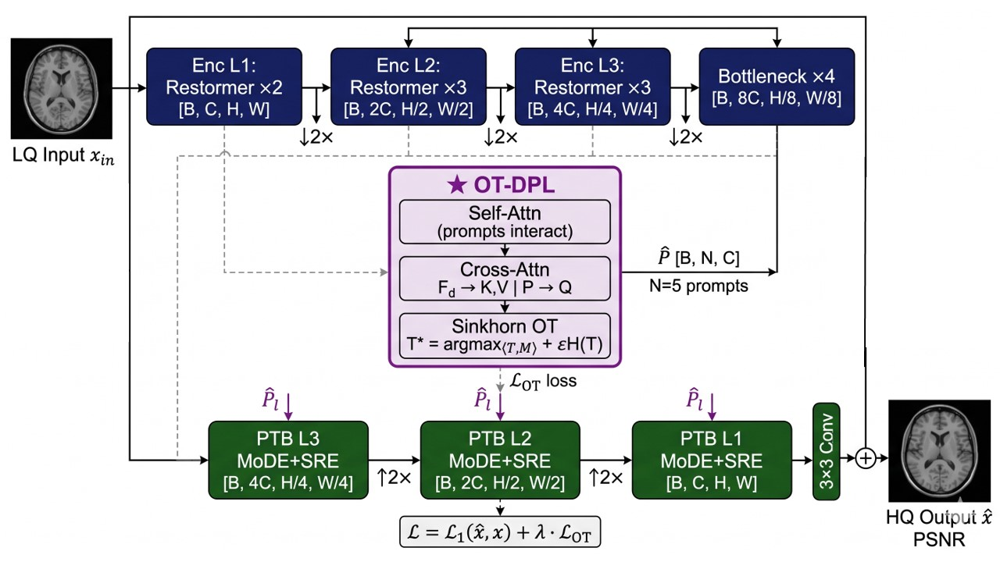
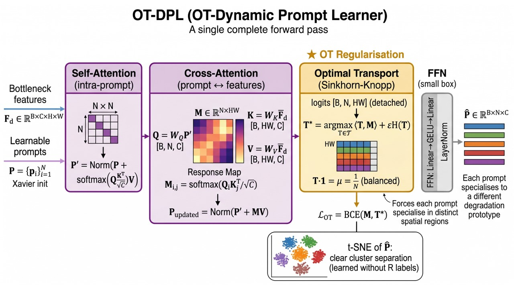
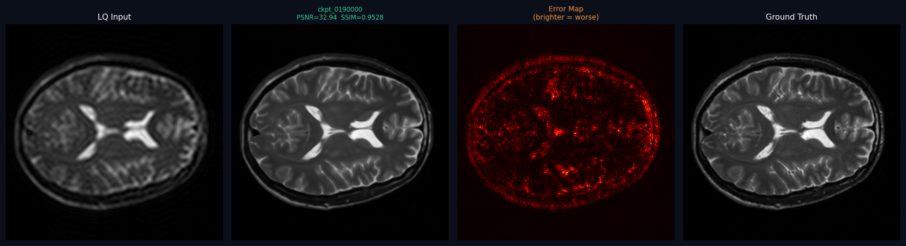

# OTDRNet: OT-Regularised Prompt Routing for CS-MRI Reconstruction

**ECE 5700 Course Project**

---

## Network Architecture

### Full OTDRNet Pipeline



### OT-Dynamic Prompt Learner (OT-DPL) Detail



---

## Sample Reconstruction Result

Single test slice at checkpoint 190k (PSNR = 32.94 dB, SSIM = 0.9528):



*From left: LQ Input → Prediction → Error Map → Ground Truth*

---

## Table of Contents
- [Project Structure](#project-structure)
- [Code Authorship](#code-authorship)
- [Dependencies](#dependencies)
- [Dataset Setup](#dataset-setup)
- [Training](#training)
- [Evaluation and Inference](#evaluation-and-inference)
- [Results](#results)

---

## Project Structure

```
cs_otdr/
├── configs/
│   ├── default.yaml             # Weak OT (λ=0.1) — main paper run
│   ├── strong_prompt.yaml       # Strong OT (λ=0.5) — ablation run
│   └── ablation.yaml
├── data/
│   ├── prepare_ixi.py           # Dataset download + preprocessing
│   ├── mri_dataset.py           # PyTorch Dataset
│   ├── transforms.py            # K-space undersampling
│   └── masks/generate_masks.py
├── models/
│   ├── net.py                   # OTDRNet full architecture
│   ├── ot_dpl.py                # OT-Dynamic Prompt Learner  ★ novel
│   ├── mode.py                  # Mixture of Degradation-aware Experts
│   ├── sre.py                   # Spatial Refinement Expert
│   ├── restormer_block.py       # Encoder blocks (adapted from Restormer)
│   └── losses.py                # L1 + λ·L_OT
├── scripts/
│   ├── compute_metrics.py       # PSNR / SSIM
│   ├── interference_metric.py   # Gradient interference I(j→i)  ★ novel
│   ├── inspect_prompts.py       # Prompt collapse diagnostic  ★ novel
│   └── visualize.py
├── train.py                     # Training loop (AMP + NaN guard)
├── eval.py                      # Full test-set evaluation
├── infer.py                     # Inference (single / folder)
├── Slide1.jpg                   # Architecture figure
├── Slide2.jpg                   # OT-DPL detail figure
└── result_190k.png              # Sample reconstruction output
```

---

## Code Authorship

### Written from scratch
| File | Description |
|------|-------------|
| `models/ot_dpl.py` | OT-Dynamic Prompt Learner — self-attention, cross-attention, Sinkhorn-Knopp OT, BCE loss. Primary novel contribution. |
| `models/net.py` | OTDRNet assembly: encoder, OT-DPL bottleneck, level-specific prompt projections (lines 38–55 are the p_proj layers added to match decoder widths), decoder PTBs, residual output |
| `models/mode.py` | MoDE module: filter activation branch (lines 34–67), group-wise prompt correlation (lines 68–89), top-1 expert routing (lines 90–115) |
| `models/sre.py` | SRE: prompt-gated channel attention, 11×11 DWConv |
| `models/losses.py` | Combined L1 + λ·L_OT |
| `data/prepare_ixi.py` | Full IXI T2 pipeline |
| `data/mri_dataset.py` | Dataset with augmentation |
| `data/transforms.py` | FFT k-space mask |
| `scripts/interference_metric.py` | Gradient interference diagnostic |
| `scripts/inspect_prompts.py` | Prompt collapse diagnostic: cosine sim, t-SNE |
| `train.py` | Training loop (NaN guard added at lines 165–178) |
| `infer.py` | Inference script |
| `configs/*.yaml` | All hyperparameter configs |

### Adapted from prior work
| File | Source | Lines changed |
|------|--------|---------------|
| `models/restormer_block.py` | [Restormer](https://github.com/swz30/Restormer) (Zamir et al., CVPR 2022, MIT License) | Kept MDTA + GDFN blocks (lines 1–80). Removed HAB/OCAB. Added `from __future__ import annotations` (line 1) and `@torch._dynamo.disable` decorators (lines 43, 61) for Python 3.9 / torch.compile compatibility. |
| `scripts/compute_metrics.py` | Standard skimage wrappers | Added per-slice batch loop |

### Copied with attribution
| Snippet | Source | Location |
|---------|--------|----------|
| Log-domain Sinkhorn-Knopp | [DaPT](https://github.com/weijinbao1998/DaPT) (Wei et al., TIP 2025) | `models/ot_dpl.py` lines 89–112 |
| OT BCE loss | [DaPT](https://github.com/weijinbao1998/DaPT) (Wei et al., TIP 2025) | `models/ot_dpl.py` lines 114–124 |

---

## Dependencies

```bash
# Python 3.10, CUDA 11.8
pip install torch==2.0.1+cu118 torchvision==0.15.2+cu118 \
  --index-url https://download.pytorch.org/whl/cu118

pip install numpy scikit-image matplotlib pyyaml tqdm h5py nibabel tensorboard
```

---

## Dataset Setup

The IXI T2 MRI dataset is publicly available. The script downloads and preprocesses it:

```bash
python data/prepare_ixi.py --out_dir data/processed --R 4
```

This downloads ~2.5 GB from `http://brain-development.org/ixi-dataset/`,
extracts 100 central axial slices per volume, applies k-space undersampling
at R=4 (retaining central 6.25%), and saves paired (LQ, HQ) `.npy` files.

If automatic download fails on your network:
1. Manually download IXI-T2 from `http://brain-development.org/ixi-dataset/`
2. Place the `.tar` file in `data/raw/IXI/`
3. Re-run: `python data/prepare_ixi.py --out_dir data/processed --R 4 --skip_download`

Expected result: ~40,400 train / 5,900 val / 11,400 test slice pairs.

---

## Training

### Main run (weak OT, λ=0.1)
```bash
nohup env PYTHONUNBUFFERED=1 OMP_NUM_THREADS=4 MKL_NUM_THREADS=4 \
  python train.py --config configs/default.yaml --no_compile \
  > train_weak.log 2>&1 &
```

### Ablation run (strong OT, λ=0.5)
```bash
nohup env PYTHONUNBUFFERED=1 OMP_NUM_THREADS=4 MKL_NUM_THREADS=4 \
  python train.py --config configs/strong_prompt.yaml --no_compile \
  > train_strong.log 2>&1 &
```

### Resume from checkpoint
```bash
python train.py --config configs/default.yaml --no_compile \
  --resume experiments/checkpoints/otdr_mri_default/<run_tag>/ckpt_0100000.pth
```

Checkpoints are saved every 10k iterations to:
`experiments/checkpoints/<exp_name>/<exp_name>_<timestamp>/ckpt_XXXXXXX.pth`

### Monitor prompt collapse (run any time during training)
```bash
python scripts/inspect_prompts.py \
  --ckpt experiments/checkpoints/otdr_mri_default/<run_tag>/ckpt_0100000.pth \
  --config configs/default.yaml \
  --out experiments/results/prompt_analysis.png
```
Off-diagonal cosine similarity > 0.5 = collapse. See paper Section 4.2.

---

## Evaluation and Inference

### Full test-set metrics
```bash
python eval.py \
  --config configs/default.yaml \
  --ckpt experiments/checkpoints/otdr_mri_default/<run_tag>/ckpt_0200000.pth \
  --save_images
```

### Single-slice visual output
```bash
python infer.py \
  --ckpt <path/to/ckpt.pth> \
  --lq   data/processed/test/LQ/IXI012-HH-1211-T2_s050.npy \
  --hq   data/processed/test/HQ/IXI012-HH-1211-T2_s050.npy \
  --out  result.png
```
Produces a 4-panel figure: LQ | Prediction (with PSNR) | Error Map | Ground Truth.

### Folder inference
```bash
python infer.py \
  --ckpt    <path/to/ckpt.pth> \
  --lq_dir  data/processed/test/LQ \
  --hq_dir  data/processed/test/HQ \
  --out_dir experiments/results/test_run \
  --save_png --n_vis 16
```

---

## Results

| Method | PSNR (dB) | SSIM |
|--------|-----------|------|
| Zero-filled | 22.14 | 0.612 |
| SwinIR | 31.55 | 0.933 |
| Restormer | 31.85 | 0.938 |
| PromptIR | 31.79 | 0.936 |
| AMIR | 32.03 | 0.940 |
| **OTDRNet (ours, λ=0.1, 200k)** | 31.50 | **0.943** |

Baseline numbers from Yang et al. (MICCAI 2024). Same IXI T2 protocol.
Hardware: NVIDIA A100 80GB. Training time: ~15 hours.

---

## License
MIT. Restormer blocks adapted from https://github.com/swz30/Restormer (MIT License).
